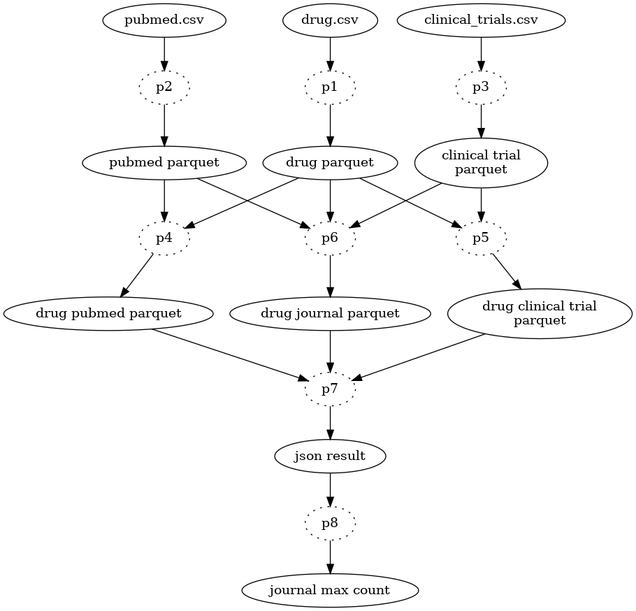

==========================
architecture des pipelines
==========================

Les pipelines sont implémentés avec spark, et utilisent le format parquet de apache hadoop.
Ils sont donc prêts pour du bigdata, en les déployant sur un cloud.

On trouve les fonctions

* *p1* : **test_de_python_v2.ingest_drug.ingest** ( see :ref:`code_p1` )

  ingère le fichier `drugs.csv` dans parquet `drug`

* *p2* : **test_de_python_v2.ingest_pubmed.ingest** ( see :ref:`code_p2` )

  ingère le fichier `pubmed.csv` dans parquet `pubmed`

* *p3* : **test_de_python_v2.ingest_clinical_trials.ingest** ( see :ref:`code_p3` )

  ingère le fichier `clinical_trials.csv` dans parquet `clinical_trial`

* *p4* : **test_de_python_v2.find_references.find_references_drug_pubmed** ( see :ref:`code_p4` )

  lit les parquet `drug` et `pubmed` et écrit les relations dans le parquet `drug-pubmed`

* *p5* : **test_de_python_v2.find_references.find_references_drug_clinical_trial** ( see :ref:`code_p5` )

  lit les parquet `drug` et `clinical_trial` et écrit les relations dans le parquet `drug-clinical_trial`

* *p6* : **test_de_python_v2.find_references.find_references_drug_journal** ( see :ref:`code_p6` )

  lit les parquet `drug`, `pubmed` et `clinical_trial` et  et écrit les relations dans le parquet `drug-journal`

* *p7* : **test_de_python_v2.json_result.write_json** ( see :ref:`code_p7` )

  lit les parquet `drug-pubmed`, `drug-clinical_trial` et `drug-journal` et écrit le fichier `result.json`

* *p8* : **test_de_python_v2.extract_journal_with_most_drugs.find_journal_with_most_drugs** ( see :ref:`code_p8` )

  lit le fichier `result.json` et renvoie le journal mentionné par le plus de drogues

===
DAG
===

le DAG est le suivant. Il permet d'écrire le séquencement des taches, à l'aide d'un ordonnanceur type airflow ou celery.

